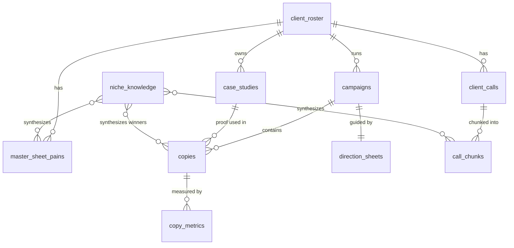

# Evergreen DB — Schema Spec & Hand-off (cold-SMS flywheel)

> **What this is.** The structure for Scaletopia's central Supabase database — the "evergreen" layer that lets
> the SMS system learn from every campaign and get better every week.
> **Who it's for.** Aaman (review every field; this is written plain on purpose) → Hilal (builds the tables).
> **Status.** STRAWMAN — redline freely. Hilal owns the technical build; this owns *what* to store and *why*.
>
> **The one idea:** every campaign leaves exhaust (a chosen case study, the copy, what happened). Today that
> exhaust dies in a folder. This DB catches it, tags it by **niche**, scores it by **real replies**, and feeds
> it back the next time we work in that niche — so a new campaign in a known niche starts at ~80%, not zero.

---

## 0. How to read this

- Each table has a **plain-English purpose** first, then the **columns**, then a **DDL sketch** (the SQL Hilal runs).
- `[exists]` = already built (leave alone). `[new]` = build it. `[greenfield]` = no data yet, fills over time.
- **Embedded fields** (the "AI language" / vector columns) are flagged 🧠. Everything else is a plain column.
- We **reuse the call-corpus pattern that already works**: Supabase + pgvector, Gemini `gemini-embedding-001`
  (1536-dim), HNSW cosine indexes, and the generic `search_call_chunks` RPC. Nothing here reinvents that.

---

## 1. The big picture

```
                         ┌──────────────────┐
                         │  client_roster   │   "who does what" — Big Leap = SEO/traffic
                         │  offer · niche    │   the spine: tags everything by niche
                         └────────┬─────────┘
              ┌───────────────────┼────────────────────┐
              ▼                   ▼                     ▼
      ┌──────────────┐   ┌──────────────────┐   ┌──────────────┐
      │ case_studies │   │ master_sheet_pains│   │  campaigns   │
      │ proof · tier  │   │ pains · lingo 🧠  │   │ niche·persona│
      │ mechanism 🧠  │   │ (per client)      │   └──────┬───────┘
      └──────┬───────┘   └─────────┬────────┘          │
             │                     │                    ▼
             │   ┌─────────────────┴───────┐     ┌──────────────┐
             │   │   call_chunks [exists]  │     │    copies    │  every text we wrote
             │   │   transcript pains 🧠   │     │ T1·T2·lever  │  winner│loser│untested
             │   └─────────────┬───────────┘     │ mechanism 🧠 │
             │                 │                  └──────┬───────┘
             ▼                 ▼                         ▼
      ╔════════════════════════════════════╗     ┌──────────────┐
      ║         niche_knowledge            ║     │ copy_metrics │  3 numbers in:
      ║  pooled + synthesized PER NICHE:   ║◄────┤ sent·pos·book│  sent / positive / booked
      ║  pains · lingo · dreams · winning  ║     └──────────────┘  → all rates computed
      ║  levers/patterns + "commonalities" ║
      ╚════════════════════════════════════╝

      direction_sheets  ── one row per campaign, links:  brief → case → lever → copy → metric
```

**Mermaid (same thing, for a rendered diagram):**



---

## 2. The weekly ritual (the engine — this is what keeps it "evergreen")

The DB only compounds if it's fed. The feeding is a **10-minute Friday habit**, run by the GTM strategist
(backed by the `sms-weekly-log` skill):

```
FRIDAY EOD
  1. OUTCOMES — for each copy that ran this week, type 3 numbers:
        sent  ·  positive_responses  ·  booked_calls
     Flag new winners / losers. If a loser → "whole copy, or which SECTION?"
        (disarmer / case line / unique mechanism / relevance / CTA) + one line why.
  2. FRESH CALLS — drop in the week's new client call transcripts.
        ↓ the skill does the rest:
  • writes copy_metrics + per-component verdicts, auto-tags (niche/persona/lever), auto-embeds new copy
  • ingests the new calls → chunk_calls.py → embed_chunks.py (incremental; skips anything already done)
  • recomputes rates, refreshes niche_knowledge for the niches that moved
        ↓
  hands back: "this week's movers" + any niche pattern that shifted + "N new calls added to [niche]"
```

**You only ever type 3 raw numbers per copy** (+ a section flag on losers). Every metric is derived from them
(§3). Fresh calls flow through the **same incremental pipeline that already exists** — the ritual just triggers
it weekly and refreshes the niche buckets so new calls sharpen the synthesis automatically. Automate the metric
input later (pull from the SMS platform); manual is fine to start.

---

## 3. The metrics that matter (only 3 raw inputs)

Per copy, per period, you log **three raw counts**; the DB computes the rest. These are the ones Aaman named:

| Metric | How it's computed | Why it matters |
|---|---|---|
| **Positive-response rate** | `positive_responses / sent` | the headline — is the copy landing? |
| **Texts per positive response** | `sent / positive_responses` | "how many sends to get a yes" |
| **Texts per booked call** | `sent / booked_calls` | the money metric — sends → meetings |
| Booked-call rate | `booked_calls / sent` | meetings per send |

Store **raw** (`sent`, `positive_responses`, `booked_calls`) and compute rates in views/queries — never store a
rate you can't recompute. A "winner" graduates from *model-scored* to *metric-defined* the moment these fill in.

---

## 4. The tables

### 4.1 `client_roster` `[new]` — who does what
**Purpose.** One row per Scaletopia client. The quick "Big Leap does SEO / traffic" reference, **and** the spine
that stamps a `niche` on everything downstream so cross-client retrieval works.

| column | type | plain meaning |
|---|---|---|
| `id` | bigserial PK | |
| `client` | text | client name (e.g. "Big Leap") |
| `slug` | text unique | lowercase id used everywhere else (`big_leap`) — matches the existing `client` text in `client_calls` |
| `offer` | text | what they sell ("SEO / organic traffic") |
| `niche` | text | their market ("legal", "DTC ecom") |
| `sub_niche` | text | finer cut ("personal-injury law", "supplements") |
| `signature_case_study_ids` | bigint[] | their strongest proofs (FK → `case_studies`) |
| `status` | text | active / paused / churned |
| `created_at` | timestamptz | |

```sql
create table if not exists client_roster (
  id            bigserial primary key,
  client        text not null,
  slug          text unique not null,
  offer         text,
  niche         text,
  sub_niche     text,
  signature_case_study_ids bigint[] default '{}',
  status        text default 'active',
  created_at    timestamptz default now()
);
create index if not exists client_roster_niche_idx on client_roster (niche);
```

### 4.2 `case_studies` `[new]` — the proof inventory
**Purpose.** Every case study we can cite, **niche-tagged** so case-study-developer can pull "what won in this
niche" across all clients — not just the current one. Seeded from Master Sheet Tab 4.

| column | type | plain meaning |
|---|---|---|
| `id` | bigserial PK | |
| `owner_client_slug` | text | which Scaletopia client owns this proof (FK → roster.slug) |
| `subject_brand` | text | the brand in the result ("Transparent Labs") |
| `niche` / `sub_niche` | text | for cross-client matching |
| `service` | text | SEO / paid creative / PR / … |
| `before_state` | text | the starting point |
| `after_state` | text | the result (revenue-first) |
| `notable_results` | text | status proofs — #1 ranking, press, outranked-rival, acquisition |
| `timeframe` | text | how fast |
| `mechanism_literal` | text | what they actually did (raw input to mining) |
| `unique_mechanism` | text | the sharpened, plain, sticky version (from case-study-developer) |
| `tier` | text | S / A / B / C / D (Master Sheet Tab 5 rules) |
| `source_url` | text | where it's verifiable |
| 🧠 `result_embedding` | vector(1536) | semantic search on the result |
| 🧠 `unique_mechanism_embedding` | vector(1536) | "find a case with a mechanism like X" |
| 🧠 `niche_embedding` | vector(1536) | fuzzy niche match |
| `created_at` | timestamptz | |

### 4.3 `master_sheet_pains` `[new]` — raw niche fuel
**Purpose.** The pains / lingo / dreams / mistaken-beliefs from each client's Master Sheet (Tab 2 + 3), stored
one row per item and **niche-tagged + embedded**. This is the raw material the niche synthesis chews on.

| column | type | plain meaning |
|---|---|---|
| `id` | bigserial PK | |
| `client_slug` | text | source client |
| `niche` / `sub_niche` | text | the bucket it belongs to |
| `kind` | text | `pain` \| `lingo` \| `dream` \| `belief` \| `objection` |
| `persona` | text | whose pain (founder / CMO / …), nullable |
| `text` | text | the verbatim item |
| 🧠 `embedding` | vector(1536) | clusters same-meaning items across clients |
| `source` | text | "Master Sheet Tab 2, row 7" |
| `created_at` | timestamptz | |

### 4.4 `niche_knowledge` `[new]` — **the cross-client prize**
**Purpose.** The synthesized view *per niche*: pool every client's pains/lingo/winning-copy in that niche,
cluster the duplicates, and write a short **"here's what they have in common"** summary that refreshes when new
data lands. This is what makes targeting "beauty & apparel" instantly surface everything every beauty client
ever taught us — deduped, not generic.

| column | type | plain meaning |
|---|---|---|
| `id` | bigserial PK | |
| `niche` | text unique-ish | the bucket ("DTC ecom / supplements") |
| `top_pains` | jsonb | clustered pains, each with how many clients said it |
| `shared_lingo` | jsonb | words real buyers in this niche use |
| `dream_outcomes` | jsonb | what they want |
| `winning_levers` | jsonb | levers/patterns that scored here (from `copies` + `copy_metrics`) |
| `commonalities_summary` | text | the AI-written synthesis ("across N clients, the recurring wall is…") |
| `source_client_slugs` | text[] | which clients fed this (so you can trust/trace it) |
| `refreshed_at` | timestamptz | when last re-synthesized |

> **How it's built:** the niche-synthesis script (mine to write) pulls all `master_sheet_pains` + `call_chunks` +
> winning `copies` for a niche, clusters by embedding similarity, and asks the model to summarize commonalities.
> Cached here so the skills read it instantly instead of re-clustering every run. Refreshed by the Friday ritual.

### 4.5 `copies` `[new — supersedes winners.csv]` — every text we've written
**Purpose.** One table for **all** copy: the 17 reference winners, our own sends, the flops. Status + metrics
make winners float and losers serve as a "never do this again" reference. Maps 1:1 onto winners.csv columns.

| column | type | plain meaning |
|---|---|---|
| `id` | bigserial PK | |
| `origin` | text | `reference_winner` (external proven, e.g. Chamber) \| `scaletopia_send` (ours) |
| `client_slug` | text | sender / owner |
| `campaign_id` | bigint | FK → campaigns (null for reference winners) |
| `case_study_id` | bigint | which proof it used (FK → case_studies) |
| `niche` / `sub_niche` | text | **filter column** |
| `persona` | text | founder / CMO / VP growth — **filter column** |
| `sophistication` | text | low … high (winners.csv) |
| `channel` | text | sms (room for email later) |
| `t1` / `t2` | text | the two texts (winners.csv `raw_T1`/`raw_T2`) |
| `char_t1` / `char_t2` | int | lengths |
| `lever` | text | FOMO/Unique/Curious/Timely/Helpful — **filter column** |
| `pattern` | text | plain-english / risk-reversal / … — **filter column** |
| `what_carries` | text | case+mechanism / case+specificity / guarantee |
| `proof_framing` | text | how the number was said (the proof-menu pick: native unit / chunked) |
| `unique_mechanism` | text | the HOW — the `{{unique_mechanism}}` slot used across our SMS flow |
| `pattern_interrupt` | text | the disarmer opener |
| `cta` | text | the ask |
| `relevance_type` | text | implicit / explicit / clay-signal |
| `status` | text | `winner` \| `loser` \| `untested` \| `draft` — **filter column** |
| `model_score` | int | the QA/rubric score (a guess until metrics exist) |
| `why_it_worked` | text | winners.csv |
| `why_it_failed` | text | the loser lesson |
| `lineage` | jsonb | what brief + case + winners it was built from |
| 🧠 `full_copy_embedding` | vector(1536) | "is this draft like things that flopped?" |
| 🧠 `t1_embedding` | vector(1536) | opener similarity |
| 🧠 `unique_mechanism_embedding` | vector(1536) | mechanism similarity / "what mechanisms won here" |
| `created_at` | timestamptz | |

> **Winners vs losers — one table or two?** Functionally identical for what you want (referencing losers as
> "avoid these"). Kept here as **one table with a `status` column** so a single semantic search can compare a new
> draft against *both* pools at once — which is the actual reinforcement move. If Hilal prefers two physical
> tables, that's fine; just expose a `winners` and a `losers` view over the same shape. **Aaman's call to confirm.**

```sql
create table if not exists copies (
  id              bigserial primary key,
  origin          text not null default 'scaletopia_send',
  client_slug     text,
  campaign_id     bigint references campaigns(id) on delete set null,
  case_study_id   bigint references case_studies(id) on delete set null,
  niche           text,
  sub_niche       text,
  persona         text,
  sophistication  text,
  channel         text default 'sms',
  t1              text,
  t2              text,
  char_t1         int,
  char_t2         int,
  lever           text,
  pattern         text,
  what_carries    text,
  proof_framing   text,
  unique_mechanism text,
  pattern_interrupt text,
  cta             text,
  relevance_type  text,
  status          text default 'untested',  -- winner | loser | untested | draft
  model_score     int,
  why_it_worked   text,
  why_it_failed   text,
  lineage         jsonb,
  full_copy_embedding vector(1536),
  t1_embedding        vector(1536),
  unique_mechanism_embedding vector(1536),
  created_at      timestamptz default now()
);
create index if not exists copies_niche_idx   on copies (niche);
create index if not exists copies_persona_idx on copies (persona);
create index if not exists copies_lever_idx   on copies (lever);
create index if not exists copies_status_idx  on copies (status);
create index if not exists copies_full_emb_hnsw on copies using hnsw (full_copy_embedding vector_cosine_ops);
```

### 4.5.1 `copy_components` `[new]` — learning at the *section* level (the bad-copy nuance)
**Purpose.** A loser copy is rarely all bad — usually **one section dragged it** (a flat disarmer, a weak CTA)
while the rest was fine. If we only flag the whole copy "loser" and avoid it wholesale, we throw away the good
parts. So every copy is **decomposed into its anatomy** (per the Voice Profile: disarmer → identity →
case-study line → unique mechanism → relevance → CTA) and winner/loser is tracked **per component**. This is
also exactly the **remix / ingredient bank** sms-draft already outputs — now persistent, niche-tagged, and
metric-aware. Net effect: a winning disarmer survives even if its parent copy flopped, and "avoid these CTAs in
supplements" becomes a precise query.

| column | type | plain meaning |
|---|---|---|
| `id` | bigserial PK | |
| `copy_id` | bigint | FK → copies (its parent) |
| `component_type` | text | `disarmer` \| `identity` \| `case_line` \| `unique_mechanism` \| `relevance` \| `cta` — **filter column** |
| `text` | text | the component itself |
| `verdict` | text | `winner` \| `loser` \| `neutral` (set in the Friday ritual; defaults to parent's status) |
| `niche` / `persona` / `lever` | text | denormalized from parent — **filter columns** |
| 🧠 `embedding` | vector(1536) | "is this disarmer like ones that flopped / won?" |
| `created_at` | timestamptz | |

> **How verdicts get set:** when the Friday ritual flags a loser, it asks *"whole copy, or which section?"* Only
> the named section(s) get `verdict='loser'`; the rest stay `neutral` (reusable). Winning copies stamp all
> components `winner`. Retrieval then avoids flopped **components**, not whole copies — answering the exact nuance
> ("it was just one section that was off, don't bin the good parts").

### 4.6 `campaigns` `[new]` — the container
**Purpose.** Groups copies + sends for one push. `id`, `client_slug`, `niche`, `persona`, `segment`, `channel`,
`start_date`, `list_source` (Clay), `notes`.

### 4.7 `copy_metrics` `[greenfield]` — the truth layer
**Purpose.** The 3 raw numbers per copy per period; rates computed from them (§3). Empty today; the Friday
ritual fills it. This is what turns "model thinks it's good" into "the market replied."

| column | type | plain meaning |
|---|---|---|
| `id` | bigserial PK | |
| `copy_id` | bigint | FK → copies |
| `campaign_id` | bigint | FK → campaigns |
| `period_start` / `period_end` | date | the week logged |
| `region` | text | optional cut (e.g. "California") |
| `sent` | int | texts sent |
| `positive_responses` | int | positive replies |
| `booked_calls` | int | meetings booked |
| `created_at` | timestamptz | |

```sql
create table if not exists copy_metrics (
  id            bigserial primary key,
  copy_id       bigint references copies(id) on delete cascade,
  campaign_id   bigint references campaigns(id) on delete set null,
  period_start  date,
  period_end    date,
  region        text,
  sent          int default 0,
  positive_responses int default 0,
  booked_calls  int default 0,
  created_at    timestamptz default now()
);
-- rates as a view, never stored:
create or replace view copy_performance as
select c.id as copy_id, c.niche, c.persona, c.lever, c.status,
       sum(m.sent) as sent, sum(m.positive_responses) as positives, sum(m.booked_calls) as booked,
       round(sum(m.positive_responses)::numeric / nullif(sum(m.sent),0), 4) as positive_rate,
       round(sum(m.sent)::numeric / nullif(sum(m.positive_responses),0), 1) as sent_per_positive,
       round(sum(m.sent)::numeric / nullif(sum(m.booked_calls),0), 1) as sent_per_booked
from copies c left join copy_metrics m on m.copy_id = c.id
group by c.id, c.niche, c.persona, c.lever, c.status;
```

### 4.8 `direction_sheets` `[new]` — the connective record
**Purpose.** One row per campaign capturing the **copy hypothesis** (persona → lever → case → mechanism →
objection → CTA-softness → why-now). It's the thread that ties brief → case → copy → metric, so later you can
ask *"what kind of direction produces winners?"* (This is the Direction Sheet we scoped previously — now a row,
not just a file.) Fields mirror the Direction Sheet blocks; `campaign_id` FK; `hypothesis_line` text.

### 4.9 `client_calls`, `call_chunks` `[exists]` — leave as-is
Already built and working. Only addition: make sure each carries a **`niche`** tag (join via `client_roster.slug`)
so call evidence feeds the niche buckets alongside Master Sheet pains.

---

## 5. Design principles (the "don't screw it up" list)

1. **Embeddings only where meaning matters** — copy text, mechanism, pains, results. Niche / persona / lever /
   status / tier are **plain columns** → exact `WHERE` filters are instant and correct; fuzzy vector match isn't.
2. **Store raw, compute rates.** Never persist a number you can't rebuild from inputs.
3. **One embedding model, one dimension** — reuse Gemini `gemini-embedding-001` @ 1536, same as `call_chunks`,
   so the generic `search_call_chunks` RPC pattern extends with zero new search code.
4. **Auto-tag on write, human confirms.** The flywheel's value dies if tagging drifts; the skills stamp
   niche/persona/lever on save and the strategist confirms.
5. **GIGO guard.** Until `copy_metrics` fills, a "winner" is the model agreeing with itself. Don't let
   model-scored winners dominate retrieval — weight by real `positive_rate` as soon as data exists, and keep
   `origin` so reference winners (no metrics) and our sends (metrics) are never confused.
6. **Recency matters** (Hilal's point) — newer copy/metrics outrank stale ones in scoring; `created_at` everywhere.

---

## 6. Seeding (what fills these on day one)

| table | seeded from | by |
|---|---|---|
| `client_roster` | the client folders + Master Sheets | quick manual pass (one row/client) |
| `case_studies` | Master Sheet Tab 4 CSVs | migration script |
| `master_sheet_pains` | Master Sheet Tab 2 + 3 CSVs | migration script |
| `copies` (winners) | `sms-playbook/winners.csv` (17 rows) | migration script (+ backfill stats where known) |
| `copies` (our sends) | `clients/*/output/*SMS*.md` | migration script (status from QA/known result) |
| `copy_metrics` | nothing yet | the Friday ritual, going forward |
| `niche_knowledge` | the above, clustered | niche-synthesis script |

Migration scripts reuse the existing `tools/` ingest + Gemini-embed pattern (`chunk_calls.py` / `embed_chunks.py`).

---

## 7. Open questions for Hilal

1. **One `copies` table + status, or split winners/losers?** (Spec assumes one + views; either works.)
2. **`niche_knowledge` — cache table (as specced) or a live materialized view?** Trade-off: freshness vs cost.
3. **Embedding the synthesis summaries themselves?** (Lets you semantic-search across niches — probably yes, later.)
4. **Metrics ingest** — manual via the skill now; which SMS platform's export do we automate against later?
5. **Re-embedding budget** — how often to refresh niche synthesis (every Friday vs on-N-new-rows)?
```
